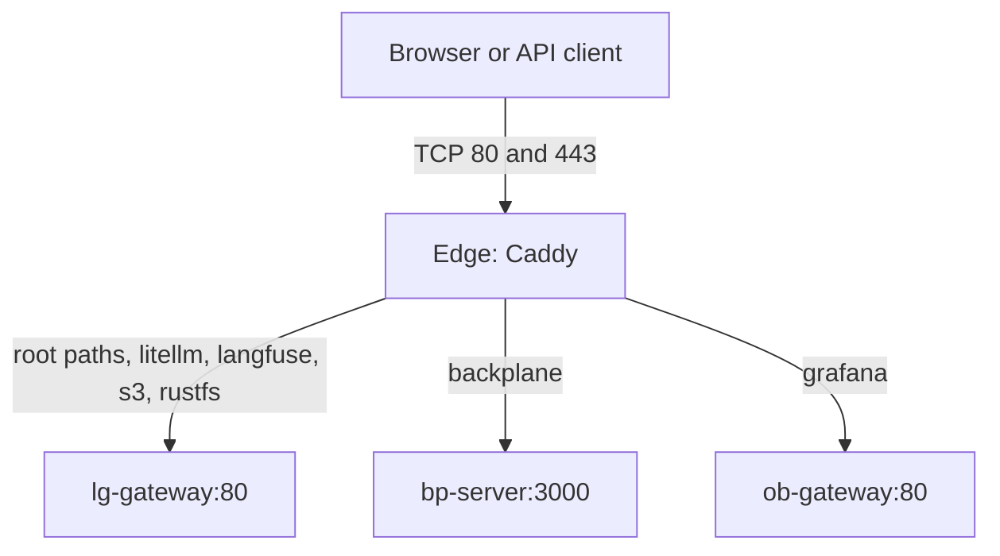

# platform-edge: systems design

One host, one Compose project, one shared Caddy for every installed platform stack.
Vocabulary lives in [CONTEXT.md](../CONTEXT.md); the decisions live in [adr/](adr/). This
document is the map; the runbooks in `operations/` hold the procedures.

- [Why it exists](#why-it-exists)
- [Guarantees](#guarantees)
- [Shape](#shape)
- [Access modes](#access-modes)
- [The bundle](#the-bundle)
- [Tailnet Origins](#tailnet-origins)
- [Status and the console](#status-and-the-console)
- [Operations](#operations)

## Why it exists

Several standalone stacks each ship an ingress, but only one ingress can own a host address
and port. Edge centralizes public port ownership and certificate renewal while preserving
each stack's standalone deployment ([ADR-0001](adr/0001-one-edge-per-host.md)).

## Guarantees

- Caddy is the only publisher in this project; the optional Tailscale nodes publish nothing
  and exist only under their profiles. Defaults bind HTTP and HTTPS to loopback.
- All seven hostnames are configured even when some stacks are absent. An unavailable
  alias produces a request failure on its own hostnames only.
- `/health` returns 200 independently of upstream readiness, on the root site and over
  HTTP in every access mode. The root serves the console with status 200 independently of
  sibling stacks.
- Every application route sets `Host` to the requested hostname and `X-Forwarded-Proto` to
  the scheme Edge received, or the configured external scheme in Proxy Mode. No forwarded
  header from a client is trusted.
- `/status.json` and `/stack-status/edge` are unauthenticated in every access mode and
  expose only the configured Caddy image (without digest), its version, the bootstrap time,
  whether backups are configured and the newest Checkpoint time.
- The certificate issuer is a setting independent of the access mode
  ([ADR-0003](adr/0003-tls-issuers.md)): `internal`, `acme` (public or private directory,
  optional trust file and external account binding) or `files` (operator certificate and
  key mounted read-only). Bootstrap refuses an issuer the mode cannot use, a file
  certificate that does not cover every configured hostname, and files Caddy cannot read;
  its HTTPS readiness probe trusts the configured CA file.
- Bootstrap renders no secrets, locks the env inode, refuses container port conflicts,
  creates the Platform Network with the contract allocation or validates an existing one,
  ensures the external volumes, runs Compose with `--wait`, and verifies the local TLS
  handshake with domain SNI. Exit codes: 0 ready, 1 refused, 2 usage, 3 not ready.

Not promised: high availability, dynamic service discovery, authentication, rate limiting.

## Shape

Caddy joins only the external Platform Network, under alias `pe-edge` at the fixed address
`PE_EDGE_IP` (`172.30.0.2`, outside the network's dynamic range). There is no project
default network, no dependency on a stack's container lifecycle and no Docker socket mount.
The external volumes `${PE_VOLUME_PREFIX}_edge-data` and `${PE_VOLUME_PREFIX}_edge-config`
keep TLS state and Caddy configuration; routine Compose teardown preserves them.

The root `Caddyfile` holds the global block, the issuer snippets (`tls-internal`,
`tls-acme`, `tls-files`) and the `site` snippet, which expands one
`import site <host> <routes>` line into the listeners of the access mode with the selected
issuer. `routes.d/gateway.caddy`, `backplane.caddy` and `observability.caddy` own the route
snippets and declare each hostname once; `routes.d/00-stack-probes.caddy` owns the status
and health routes Edge itself serves. Bootstrap derives the hostnames it probes and the
certificate coverage check from the `import site` lines. Adding a hostname means a Route
File line, a console catalog entry and smoke coverage.

## Access modes

Local Mode serves HTTP and self-signed HTTPS together, without redirects or HSTS. Public
Mode obtains trusted certificates for the domain and redirects HTTP to HTTPS, keeping the
root HTTP health route reachable before the redirect. Proxy Mode receives HTTP from another
gateway that handles HTTPS. The mode selects the listeners; the browser scheme
(`PE_SCHEME`) is a separate setting that the siblings receive as their application origin.
Stack Caddys listen on HTTP behind Edge while their applications keep public HTTPS origins;
Backplane ignores forwarded headers and takes an explicit `BP_PUBLIC_URL`.

## The bundle

Sibling stacks are installed behind Edge through bootstrap's `--with <stack>` flags.
`scripts/bundle.py` preflights every selected checkout, writes only the Platform Contract's
bundle settings into each sibling `.env` under that stack's own lock, with an atomic
replacement that keeps unrelated lines byte for byte and never prints or interprets a
secret, then runs the sibling's own bootstrap from its checkout, stopping at the first
failure with the rerun command. Secret generation, source parsing and lifecycle logic stay
in the stacks. `--dry-run` prints the plan and writes nothing. The
[ingress runbook](operations/ingress.md#install-the-bundle) describes the command, reruns
and failure handling.

## Tailnet Origins

`compose.tailscale.yaml` adds one `tailscale/tailscale` node per routed hostname
(`ts-console`, `ts-litellm`, `ts-langfuse`, `ts-s3`, `ts-rustfs`, `ts-backplane`,
`ts-grafana`), each under its own profile, on the Platform Network only, in userspace mode
with every capability dropped, with its identity in the external volume
`${PE_VOLUME_PREFIX}_ts-<name>`. One static serve config (`docker/tailscale/serve.json`)
makes every node terminate `https://<name>.<tailnet>.ts.net` with a Tailscale-issued
certificate and proxy to `pe-edge:80` with the original Host. Route Files add one
`import tailnet-site <name> <routes>` line per hostname; the snippet expands only when the
overlay sets `PE_TAILNET` and sets `X-Forwarded-Proto: https` for requests from the
Platform Network's dynamic range, where the nodes live. `bootstrap.py --tailscale` records
the selection and the tailnet domain in `.env` so plain Compose keeps the nodes, and the
bundle writes the Tailnet Origins into the sibling browser-origin settings. The nodes form
one authorization domain; see [ADR-0004](adr/0004-tailscale-sidecars.md) and the
[Tailscale runbook](operations/tailscale.md).

## Status and the console

The [status contract](operations/status-contract.md) defines a versioned public interface
between independent producers and console consumers. After readiness, bootstrap writes
Edge's own Status Document from `docker compose config` into the directory mounted
read-only at `/srv/state`, atomically; there is no host observer, timer or `docker exec`.
Edge proxies each sibling's document and Health Paths same-origin at `/stack-status/<stack>`
with credentials stripped and bounded responses.

The console is static HTML, CSS and JavaScript in `docker/console/`, mounted read-only,
with no build step. Project cards, search, service details and an architecture map share
one catalog (`catalog.js`), which describes the stack architecture, not detected
installation state. It refreshes access settings (`/edge-config.json`, uncached) and
health at load, on request, and every 30 seconds while visible, without continuous
animation. Cards link their titles to application interfaces and provide copyable
endpoints; component links come only from Edge's own access configuration, never from a
document `url`. Components show what each stack's Status Document says was configured:
Configured with its version, Not enabled, or Unknown when the document or component is
missing or invalid. The bounded consumer reads the `/stack-status/<stack>` documents with
three concurrent requests, four-second deadlines and 64 KiB and 32-component limits; a
missing producer leaves components Unknown and never blocks another card.

## Operations

- Bootstrap and the modes: [ingress](operations/ingress.md). Only move ports or restart
  services as an authorized installation action. Port conflict checks cover overlapping
  TCP bindings and ranges and ignore this project's own Caddy for idempotent reruns.
- Validation and smoke use the shipped validated default image regardless of local image
  overrides. Validation mounts every Route File in local, public and proxy modes across the
  issuer variants. Smoke owns a fresh project and a network on a disjoint `172.16.x.0/24`
  subnet, starts three stubs, then tests routing, TLS scheme forwarding, operator
  certificate files signed by a throwaway CA, restart with an absent alias, and independent
  console availability; it never adopts an existing network.
- Certificate Checkpoints and the restore drill: [backup](operations/backup.md). This repo
  has no application secrets, no datastore checkpoint tooling and no separate stack gateway.
- Runtime logs go to journald without a Docker log cache; the host owns retention, Alloy
  collection is optional.
- `docs/conventions.md` is canonical here and vendored into the siblings byte for byte by
  `scripts/sync-conventions.sh`.
