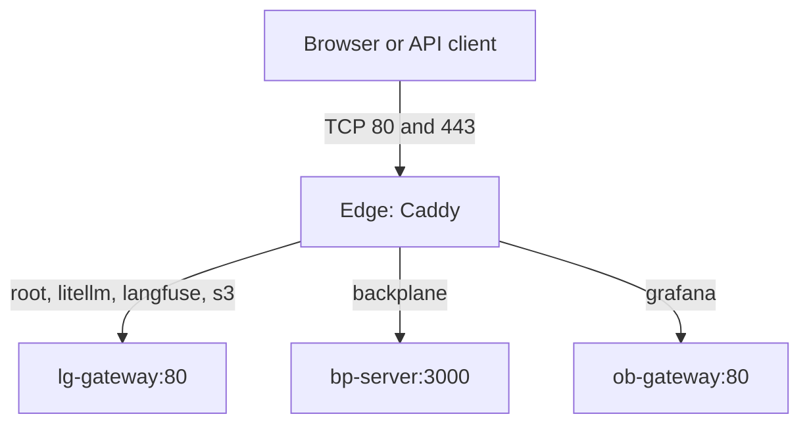

# platform-edge: systems design

One host, one Compose project, one shared Caddy for every installed platform stack. Vocabulary lives in [CONTEXT.md](../CONTEXT.md); the decision lives in [ADR-0001](adr/0001-one-edge-per-host.md).

## Why it exists

Multiple standalone stacks each ship an ingress, but only one ingress can own a given host address and port. The Edge centralizes public port ownership and certificate renewal while preserving each stack's standalone deployment.

## Guarantees, stated exactly

- Caddy is the only service and publisher in this project. Defaults bind HTTP and HTTPS ports to loopback.
- All six hostnames are configured even when some stacks are absent. An unavailable alias produces a request failure, independent of other aliases.
- `/health` returns 200 independently of upstream readiness. It is available on the root site and over HTTP in every TLS mode.
- Every application route sets `Host` to the requested hostname and `X-Forwarded-Proto` to the scheme received by the Edge.
- The root gateway failure serves a small static fallback page with status 502. Its three same-origin probes show which stack ingress answers. Application health remains a stack concern.
- Bootstrap renders no secrets, locks the env inode, refuses container port conflicts, ensures the network and external volumes, runs Compose with `--wait`, and prints route-derived hostnames. HTTPS readiness verifies the local TLS handshake with domain SNI and publishes the root leaf expiry. Exit codes match the sibling bootstrap contract: 0 ready, 1 refused, 2 usage, 3 not ready.

No high availability, dynamic service discovery, authentication, rate limiting or edge dashboards are promised.

## Shape

Caddy joins only the external Platform Network, under alias `pe-edge`. There is no project-default network and no dependency on a stack's container lifecycle. The external volumes `${PE_VOLUME_PREFIX}_edge-data` and `${PE_VOLUME_PREFIX}_edge-config` keep TLS state and Caddy configuration state; routine Compose teardown preserves them. There is no Docker socket mount.

The root `Caddyfile` holds the shared global block and issuer snippets. `routes.d/gateway.caddy`, `backplane.caddy` and `observability.caddy` own the site blocks. The fallback page is the single `docker/console/index.html` file, mounted read-only. It checks once at load and on request, with no background animation.

## Access modes

Local Mode uses HTTP and `localhost`. Public Mode uses HTTPS with ACME; Private Mode uses HTTPS with Caddy's internal CA. The root HTTP health site is explicit in HTTPS mode because automatic redirect routes precede a catch-all site. Other root HTTP paths redirect to HTTPS. [Caddy documents this routing order](https://caddyserver.com/docs/automatic-https).

The ACME email is scoped to the ACME issuer so it is ignored in the other modes. Its empty value uses Caddy's default. Site addresses use the public scheme. Stack Caddys use a separate HTTP listen scheme behind the Edge, while their applications retain public HTTPS origins. Backplane ignores forwarded headers and requires an explicit public URL.

## Operations

The ingress runbook contains exact per-stack settings and rollout order. Only move ports or restart services as an authorized installation action. Port conflict checks include overlapping TCP bindings and port ranges, and ignore this project's existing Caddy for idempotent reruns. Host-process conflicts and races after preflight remain Compose startup errors.

Validation uses the pinned image and mounts every Route File in HTTP, ACME and internal CA modes. Smoke owns a fresh project and network, starts three independent stubs using the same image, then tests routing, TLS scheme forwarding, restart with an absent alias, and fallback behavior. Smoke refuses existing project containers or volumes and never adopts an existing network.

Adding a hostname requires updating its Route File and the fallback page and extending smoke coverage. Bootstrap derives its JSON hostnames directly from the simple site-address lines in Route Files. Images are pinned only in Compose. The shared conventions file is copied verbatim; this repo has no application secrets, datastore checkpoint tooling or separate stack gateway. Certificate Checkpoints and restore drills are described in [backup](operations/backup.md).
