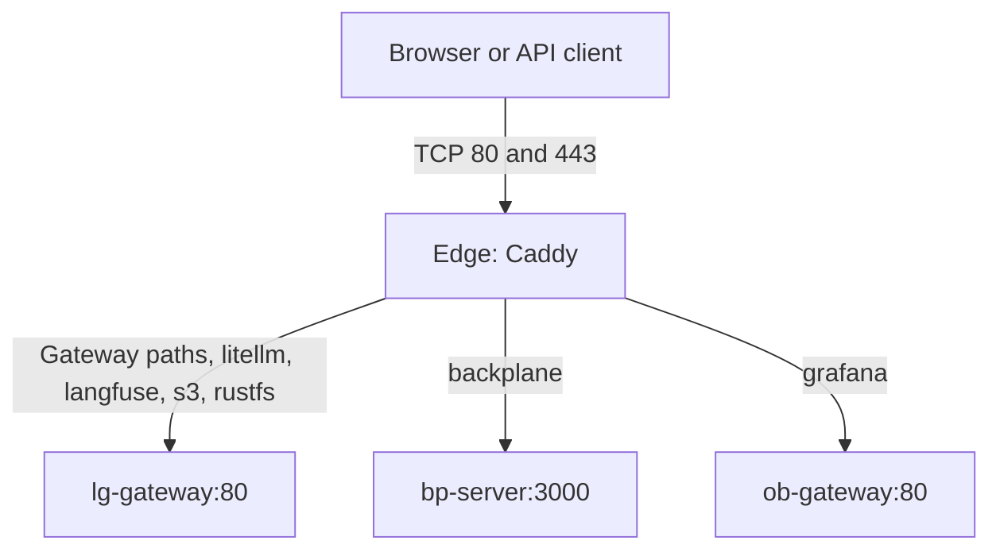

# platform-edge: systems design

One host, one Compose project, one shared Caddy for every installed platform stack. Vocabulary lives in [CONTEXT.md](../CONTEXT.md); the decision lives in [ADR-0001](adr/0001-one-edge-per-host.md).

## Why it exists

Multiple standalone stacks each ship an ingress, but only one ingress can own a given host address and port. The Edge centralizes public port ownership and certificate renewal while preserving each stack's standalone deployment.

## Guarantees, stated exactly

- `/status.json` and `/stack-status/edge` are unauthenticated in every access mode, including public internet access, and expose the configured Caddy image (without digest), its version, the bootstrap time, whether backups are configured and the newest Checkpoint time.
- Caddy is the only publisher in this project; the optional Tailscale nodes publish nothing and exist only under their profiles. Defaults bind HTTP and HTTPS ports to loopback.
- All seven hostnames are configured even when some stacks are absent. An unavailable alias produces a request failure, independent of other aliases.
- `/health` returns 200 independently of upstream readiness. It is available on the root site and over HTTP in every access mode.
- Every application route sets `Host` to the requested hostname and `X-Forwarded-Proto` to the scheme received by Edge, or the configured external scheme when another gateway handles HTTPS.
- The root serves the project console with status 200 independently of sibling stacks. Same-origin probes report application failures; application health remains a stack concern.
- The certificate issuer is a setting independent of the access mode ([ADR-0003](adr/0003-tls-issuers.md)): `internal`, `acme` (public or private directory, optional trust file and external account binding) or `files` (operator certificate and key mounted read-only). Bootstrap refuses an issuer the mode cannot use, a file certificate that does not cover every configured hostname, and files Caddy cannot read; its HTTPS readiness probe trusts the configured CA file.
- Bootstrap renders no secrets, locks the env inode, refuses container port conflicts, creates the Platform Network with the contract allocation or validates an existing one, ensures external volumes, runs Compose with `--wait`, and prints route-derived hostnames. HTTPS readiness verifies the local TLS handshake with domain SNI and publishes the root leaf expiry. Exit codes match the sibling bootstrap contract: 0 ready, 1 refused, 2 usage, 3 not ready.

No high availability, dynamic service discovery, authentication, rate limiting or edge dashboards are promised.

Sibling stacks are installed behind Edge through bootstrap's `--with <stack>` flags.
`scripts/bundle.py` preflights every selected checkout, then writes only the Platform
Contract's bundle settings into each sibling `.env` under that stack's own lock, with an
atomic replacement that keeps unrelated lines byte for byte and never prints or interprets a
secret, and runs
the sibling's own bootstrap from its checkout, stopping at the first failure with the rerun
command. No custody check, source parsing, lifecycle logic or secret generation moves out
of the owning stacks. `--dry-run` prints the plan and writes nothing. The
[bundle runbook](operations/ingress.md#install-the-bundle) describes the command, reruns
and failure handling; completion claims neither host acceptance nor enrollment.

## Shape

Caddy joins only the external Platform Network, under alias `pe-edge` at the fixed address `PE_EDGE_IP` (`172.30.0.2`, outside the network's dynamic range). There is no project-default network and no dependency on a stack's container lifecycle. The external volumes `${PE_VOLUME_PREFIX}_edge-data` and `${PE_VOLUME_PREFIX}_edge-config` keep TLS state and Caddy configuration state; routine Compose teardown preserves them. There is no Docker socket mount.

The root `Caddyfile` holds the shared global block, the issuer snippets (`tls-internal`, `tls-acme`, `tls-files`) and the `site` snippet, which expands one `import site <host> <routes>` line into the listeners of the access mode with the selected issuer. `routes.d/gateway.caddy`, `backplane.caddy` and `observability.caddy` own the route snippets and declare each hostname once. The root `/` serves the console even without Gateway; other Gateway paths retain their proxy routes. The console uses static HTML, CSS and JavaScript in `docker/console/`, mounted read-only, with no build step. Project cards, search, service details and an architecture map share one catalog. It refreshes access settings and health at load, on request, and every 30 seconds while visible, without continuous animation. Cards link their titles to application interfaces and provide copyable endpoints. HTTP probes report reachability only. Components show what each stack's contract 2 Status Document says was configured: Configured with its version, Not enabled, or Unknown when the document or component is missing or invalid. Optional components and map connections describe the stack architecture, not detected installation state or live traffic. The bounded status consumer reads independent `/stack-status/{stack}` documents with three concurrent requests, four-second deadlines and 64 KiB/32-component limits. Missing producers leave components unknown and preserve trusted console navigation. `routes.d/00-stack-probes.caddy` owns these credential-free metadata routes; its prefix makes shared snippets available before application Route Files are expanded. Project icons are bundled locally. The uncached `/edge-config.json` endpoint keeps already-open pages current after access setup changes.

## Access modes

Local mode serves HTTP and self-signed HTTPS together, without redirects or browser policies that force HTTPS. Public mode obtains trusted certificates for your domain and redirects HTTP to HTTPS. Behind another gateway (`proxy`), Edge receives HTTP and the other gateway handles HTTPS. In public mode, the explicit root HTTP health route remains reachable before the redirect. [Caddy documents this routing order](https://caddyserver.com/docs/automatic-https).

The ACME settings are used only by the `acme` issuer; an empty email or directory uses Caddy's default. Site addresses follow the access mode; the canonical application scheme remains a separate setting. Stack Caddys use a separate HTTP listen scheme behind the Edge, while their applications retain public HTTPS origins. Backplane ignores forwarded headers and requires an explicit public URL.

## Operations

The [public stack status contract](operations/status-contract.md) defines a versioned
interface for independent status producers and console consumers. Its fixtures describe
compatibility and freshness requirements; they do not attest deployed producer support.

After readiness, bootstrap writes Edge's own Status Document from `docker compose config`
into the directory mounted read-only at `/srv/state`, atomically. There is no host
observer, timer or `docker exec` status probe;
[the upgrade step](operations/ingress.md#status-version-2-upgrade) retires the version 1 timer.

The ingress runbook contains exact per-stack settings and rollout order. Only move ports or restart services as an authorized installation action. Port conflict checks include overlapping TCP bindings and port ranges, and ignore this project's existing Caddy for idempotent reruns. Host-process conflicts and races after preflight remain Compose startup errors.

Validation and smoke use the shipped validated default image regardless of local image overrides. Validation mounts every Route File in local, public and proxy modes across the issuer variants. Smoke owns a fresh project and a network on a disjoint `172.16.x.0/24` subnet, starts three independent stubs using the same image, then tests routing, TLS scheme forwarding, operator certificate files signed by a throwaway CA, restart with an absent alias, and independent console availability. Smoke refuses existing project containers or volumes and never adopts an existing network.

Adding a hostname requires updating its Route File and the console and extending smoke coverage. Bootstrap derives its JSON hostnames and the certificate coverage check from the `import site` lines in Route Files. Validated image defaults are pinned only in Compose; `PE_CADDY_IMAGE` accepts a complete reference for unvalidated local experiments. `docs/conventions.md` is canonical here and vendored into the siblings byte for byte by `scripts/sync-conventions.sh`; this repo has no application secrets, datastore checkpoint tooling or separate stack gateway. Certificate Checkpoints and restore drills are described in [backup](operations/backup.md).

Access logs are JSON on stdout; runtime diagnostics are on stderr. Docker sends both to
journald without a Docker log cache. The host owns journal retention, and Alloy collection
is optional. Local console aliases do not change application origins or grant metrics access.

## Tailnet Origins

`compose.tailscale.yaml` adds one `tailscale/tailscale` node per routed hostname
(`ts-console`, `ts-litellm`, `ts-langfuse`, `ts-s3`, `ts-rustfs`, `ts-backplane`,
`ts-grafana`), each under its own profile, on the Platform Network only, in userspace mode
with every capability dropped, with its identity in the external volume
`${PE_VOLUME_PREFIX}_ts-<name>`. One static serve config (`docker/tailscale/serve.json`)
makes every node terminate `https://<name>.<tailnet>.ts.net` with a Tailscale-issued
certificate and proxy to `pe-edge:80` with the original Host. `python3 scripts/bootstrap.py
--tailscale` requires `PE_TS_AUTHKEY`, records the overlay and one profile per node named in
`PE_TS_APPS` in `.env` (`COMPOSE_FILE`, `COMPOSE_PROFILES`) so plain Compose and ordinary
reruns keep them, starts the nodes, waits until each reports Running under its expected
name, records `PE_TAILNET_DOMAIN` once, starts Edge with the overlay, and probes each origin
over HTTPS from the host (skipped with a message when MagicDNS does not resolve the names
here). Route Files add one `import tailnet-site <name>
<routes>` line per hostname; the snippet expands only when the overlay sets `PE_TAILNET` and
sets `X-Forwarded-Proto: https` for requests from the Platform Network's dynamic range, where
the nodes live, while loopback requests keep their own scheme and no forwarded header is
trusted. The bundle owns the sibling browser-origin settings: the Tailnet Origin of each
selected node while the selection is recorded, the public-domain origin otherwise. See [ADR-0004](adr/0004-tailscale-sidecars.md) for the trade-offs, including the
single authorization domain the nodes form.
